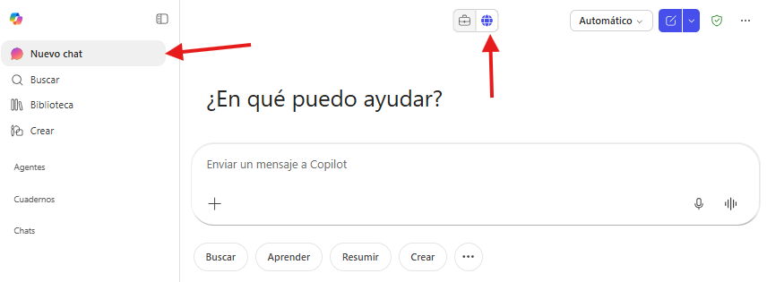
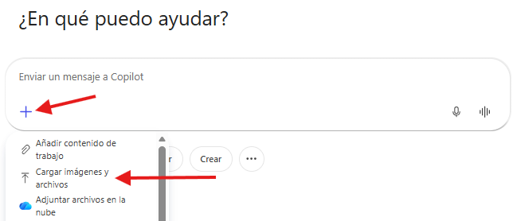
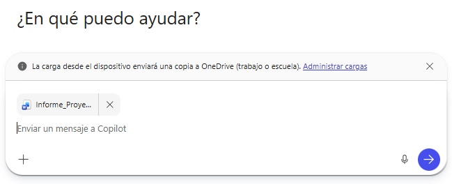
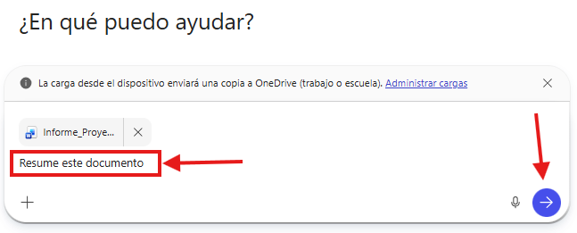
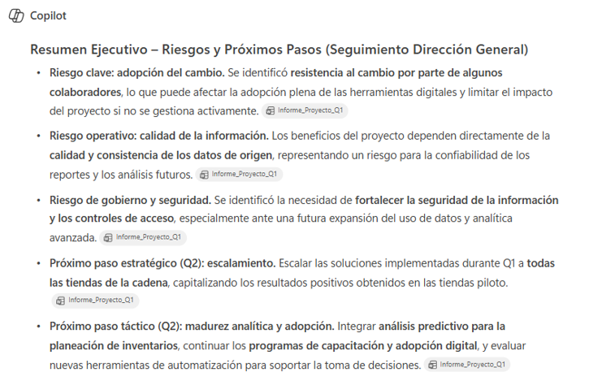

# Práctica 1. Creación de Prompts Efectivos en Microsoft 365 Copilot Chat

## Objetivo de la práctica:
Al finalizar esta actividad, será capaz de identificar las deficiencias de un prompt mal definido, crear prompts efectivos incorporando contexto, fuente, objetivo y expectativa.

## Duración aproximada:
- 7 minutos.

## Tabla de ayuda:
Para poder replicar esta práctica, se recomienda iniciar sesión con el correo corporativo o educativo en la siguiente plataforma:

| Sitio web | Enlace |
| --- | --- | 
| m365 Copilot | https://m365.cloud.microsoft/ |

## Instrucciones 
Usted es parte de un equipo de trabajo que debe preparar un resumen ejecutivo a partir de un documento extenso para compartirlo con la Dirección.
Utilizará Microsoft 365 Copilot Chat para generar el resumen y evaluar cómo cambia el resultado según la calidad del prompt.

### Tarea 1. Acceso a Microsoft 365 Copilot Chat
Paso 1. Acceder a m365 Copilot desde https://m365.cloud.microsoft/

Paso 2. Iniciar sesión con cuenta profesional o educativa.

Paso 3. Dar clic en "Nuevo chat" para crear una nueva conversación y asegurarse de encontrarse en "modo web"



### Tarea 2. Primera interacción
Paso 1. Descargar el archivo [Informe_Proyecto_Q1.docx](../images/Informe_Proyecto_Q1.docx)

Paso 2. En el recuadro del prompt, seleccionar (+) Agregar contenido.

Paso 3. Seleccionar Cargar imágenes y archivos. 



Paso 4. Seleccionar archivo Informe_Proyecto_Q1.docx y confirmar que el archivo se integre en el recuadro de chat.



Paso 5. Escribir en el recuadro de chat la siguiente solicitud (prompt) y enviarla (dar clic en la flecha de la esquina inferior derecha o presionar Enter).

```text
Resume este documento.
```




Paso 6. Observar el resultado.

- ¿Es claro?
- ¿Está orientado a alguien en particular?
- ¿El nivel de detalle es adecuado?
- ¿Responde realmente a una necesidad de negocio?
- ¿Por qué el prompt es deficiente?

### Tarea 2. Segunda interacción
Paso 1. En la misma conversación, redactar el siguiente prompt e incluir el archivo Informe_Proyecto_Q1.docx:

```text
Necesito preparar un resumen ejecutivo para la dirección general.
Este resumen será utilizado en una reunión de seguimiento del proyecto.
Extrae los puntos más relevantes del avance del proyecto.
Usa únicamente el documento cargado “Informe_Proyecto_Q1.docx”.
Resume el contenido en 5 viñetas claras, con tono ejecutivo y conciso, e incluye brevemente los riesgos identificados.
```


Paso 2. Enviar el prompt y analizar el nuevo resultado.

- ¿Cuál respuesta utilizaría en un entorno real de trabajo?
- ¿Qué mejoras específicas observa?
- ¿Qué elemento del prompt tuvo mayor impacto en el resultado?

Paso 3. Refinar el prompt con una indicación adicional, por ejemplo:

```text
Ajusta el resumen para que enfatice únicamente riesgos y próximos pasos.
```

Observar cómo Copilot responde a la iteración, reforzando el carácter conversacional.

### Resultado esperado

Al finalizar esta práctica, el participante será capaz de comprender que:
- Un prompt mal definido produce respuestas genéricas.
- Un prompt con contexto + fuente + objetivo + expectativa genera resultados más precisos, relevantes y profesionales.
- La calidad del resultado depende directamente de la calidad del prompt.

Se obtendrá un resultado parecido a:


