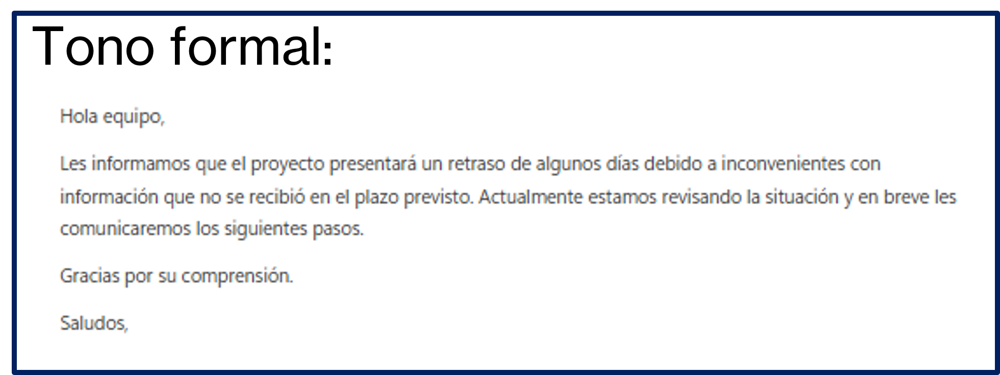
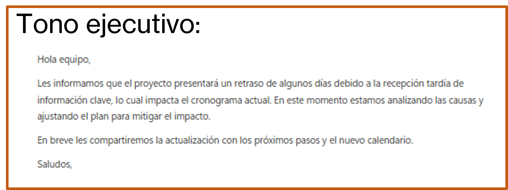
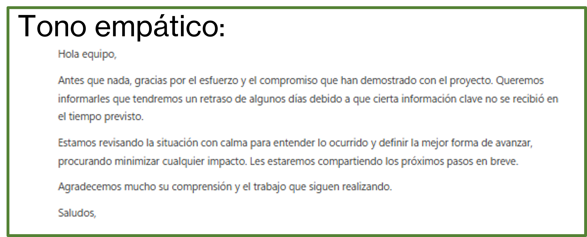

# Práctica 2. Redacción Corporativa: Mejora redacción de correos, ajusta tono (formal, ejecutivo, empático), crea borradores de comunicados

## Objetivo de la práctica:
Al finalizar esta actividad, serás capaz de utilizar Copilot Chat para mejorar la redacción de correos corporativos, ajustar el tono del mensaje según el público objetivo y crear borradores claros y profesionales a partir de texto base.

## Duración aproximada:
- 7 minutos.

## Tabla de ayuda:
Para que puedas replicar esta práctica, se recomienda iniciar sesión con tu correo corporativo en la siguiente plataforma:

| Sitio web | Enlace |
| --- | --- | 
| m365 Copilot | https://m365.cloud.microsoft/ |

## Instrucciones 
Usted es responsable de enviar un correo a un equipo interno para informar sobre un retraso en la entrega de un proyecto.
El mensaje debe ser claro, profesional y adaptarse a diferentes contextos organizacionales.

### Tarea 1. Acceso a Microsoft 365 Copilot Chat
Paso 1. Acceder a m365 Copilot desde https://m365.cloud.microsoft/

Paso 2. Iniciar sesión con cuenta profesional o educativa.

Paso 3. Dar clic en "Nuevo chat" para crear una nueva conversación y asegurarse de encontrarse en "modo web"


### Tarea 2. Solicitud de mejora sin detalles
Paso 1. Escribir en el recuadro de chat la siguiente solicitud (prompt) y enviarla (dar clic en la flecha de la esquina inferior derecha o presionar Enter).

```text
Mejora este correo:
Hola equipo,
El proyecto se va a retrasar unos días porque hubo algunos problemas con información 
que no llegó a tiempo.
Estamos revisando qué pasó y luego avisamos cómo seguimos.
Gracias.
```

Paso 2. Observar el resultado

- ¿El mensaje es claro?
- ¿El tono es adecuado para un entorno corporativo?
- ¿Especifica acciones o próximos pasos?

### Tarea 3. Solicitud de mejora bien estructurada
Paso 1. En la misma conversación, redactar el siguiente prompt:

```text
Necesito mejorar la redacción de un correo interno.
Es un mensaje para el equipo de trabajo sobre un retraso en un proyecto.
Quiero informar de manera clara y profesional sobre el retraso.
Reescribe el correo con un tono formal, claro y respetuoso, manteniendo el mensaje 
breve y profesional.

Texto original:
Hola equipo,
El proyecto se va a retrasar unos días porque hubo algunos problemas con información 
que no llegó a tiempo.
Estamos revisando qué pasó y luego avisamos cómo seguimos.
Gracias.
```

Paso 2. Analizar cómo cambia el resultado al integrar los cuatro elementos recomendados en un prompt y solicitar usar un tono formal.

Paso 3. Solicitar cambiar el tono:

```text
Reescribe el correo con un tono ejecutivo, enfocado en impacto y próximos pasos.
```

Observar que ahora se utiliza un lenguaje más directo, se enfoca en decisiones y avances y hay una menor informalidad.

Paso 4. Solicitar cambiar el tono:

```text
Ahora reescribe el correo con un tono empático, reconociendo el esfuerzo del equipo y transmitiendo tranquilidad.
```

Observar que ahora se reconoce el trabajo del equipo, se usa un lenguaje cercano pero profesional y hay un enfoque en confianza y colaboración.

Paso 5. Compara los resultados:

- ¿Cuál usarías para enviar un correo a Dirección?
- ¿Cuál enviarías directamente a tu equipo?
- ¿Cuál genera mayor confianza?


### Resultado esperado
Al finalizar esta práctica, el participante será capaz de comprender que:
- Copilot Chat puede adaptar el mensaje al contexto y audiencia.
- El tono depende directamente del prompt.
- Un prompt estructurado produce resultados claros, profesionales y reutilizables.
- La iteración es clave para refinar la comunicación corporativa.

Se obtendrá un resultado parecido a:






