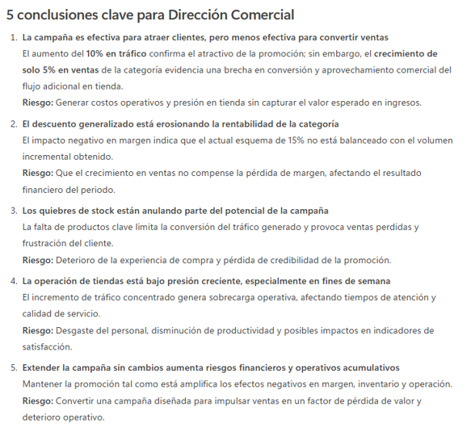

# Resumen y Análisis: Resumir textos largos, extrae puntos clave, identifica riesgos o conclusiones, resumir el siguiente contenido en 5 puntos clave y destaca posibles riesgos

## Objetivo de la práctica:
Al finalizar esta actividad, serás capaz de utilizar Copilot Chat para resumir textos largos de manera efectiva, extraer puntos clave relevantes para un contexto laboral e identificar riesgos y conclusiones a partir de un documento.

## Duración aproximada:
- 7 minutos.

## Tabla de ayuda:
Para que puedas replicar esta práctica, se recomienda iniciar sesión con tu correo corporativo en la siguiente plataforma:

| Sitio web | Enlace |
| --- | --- | 
| m365 Copilot | https://m365.cloud.microsoft/ |

## Instrucciones 
Usted es parte del equipo corporativo de una cadena retail de tiendas físicas.
Durante el último mes se lanzó una campaña promocional en tiendas para incrementar las ventas de una categoría clave.
La Dirección solicita un análisis rápido para decidir si la campaña debe:
- Continuar
- Ajustarse
- Cancelarse

Usarás Microsoft 365 Copilot Chat para analizar la información y apoyar esta decisión.

### Tarea 1. Acceso a Microsoft 365 Copilot Chat
Paso 1. Acceder a m365 Copilot desde https://m365.cloud.microsoft/

Paso 2. Iniciar sesión con cuenta profesional o educativa.

Paso 3. Dar clic en "Nuevo chat" para crear una nueva conversación y asegurarse de encontrarse en "modo web"


### Tarea 2. Interacción con M365 Copilot Chat
Paso 1. Escribir en el recuadro de chat la siguiente solicitud (prompt) y enviarla (dar clic en la flecha de la esquina inferior derecha o presionar Enter).

```text
Necesito apoyo para tomar una decisión de negocio.
Somos una empresa del sector retail con tiendas físicas.
Debo analizar los resultados de una campaña promocional.
Analiza la información, identifica beneficios y riesgos,
y proporciona una recomendación clara sobre si la campaña debe continuar,
ajustarse o cancelarse, usando un tono ejecutivo.

Información:
Durante el último mes se lanzó una promoción del 15% de descuento en la categoría
de electrónica en tiendas físicas.
Resultados observados:
- Incremento de tráfico en tienda del 10%.
- Incremento de ventas del 5% en la categoría promocionada.
- Margen reducido debido a descuentos.
- Mayor carga operativa en tiendas los fines de semana.
- Algunos productos clave tuvieron quiebres de stock.
La campaña estaba planeada inicialmente para dos meses.
```

Observa el resultado:

- ¿Ayuda a tomar una decisión?
- ¿Es claro para un directivo?

Paso 2. Explorar escenarios alternativos, por ejemplo:

```text
Propón dos escenarios alternativos para la campaña
(incluyendo posibles ajustes) y explica brevemente
el impacto esperado en ventas y operación.
```

Observa:

- Capacidad de Copilot para generar idear alternativas
- Enfoque en decisiones realistas

Paso 3. Solicitar identificar los posibles riesgos:

```text
Identifica los principales riesgos de continuar la campaña sin ajustes
y su posible impacto en la operación de tiendas.
```

Observa:
- ¿En qué formato se encuentra la respuesta generada?
- ¿Considera que esta información es suficiente para tomar una decisión?

Paso 4. Solicitar una síntesis en en 5 puntos clave, destacando los posibles riesgos:

```text
Resume el análisis en 5 conclusiones clave para la Dirección comercial y destaca posibles riesgos
```

Analiza:
- ¿Hubo algún riesgo que no se identificó con Copilot?
- ¿Considera que únicamente debería tomar en cuenta los riesgos mencionados por Copilot?

### Resultado esperado
Al finalizar esta práctica, el participante será capaz de comprender que:
- Copilot Chat permite analizar escenarios reales de cualquier sector.
- Un prompt bien definido:
    - Genera análisis útil
    - Apoya decisiones comerciales
    - Reduce el tiempo de evaluación
- La IA puede apoyar tanto el análisis numérico como el juicio estratégico.
- Copilot es una herramienta para decidir mejor, no solo para escribir.

Se obtendrá un resultado parecido a:


