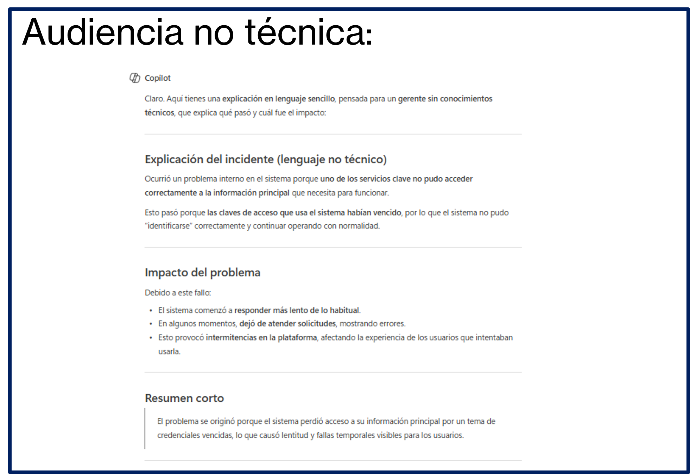
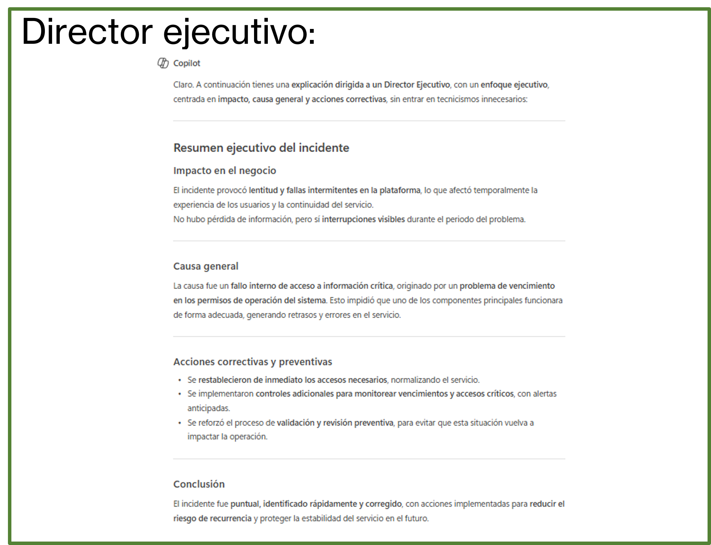
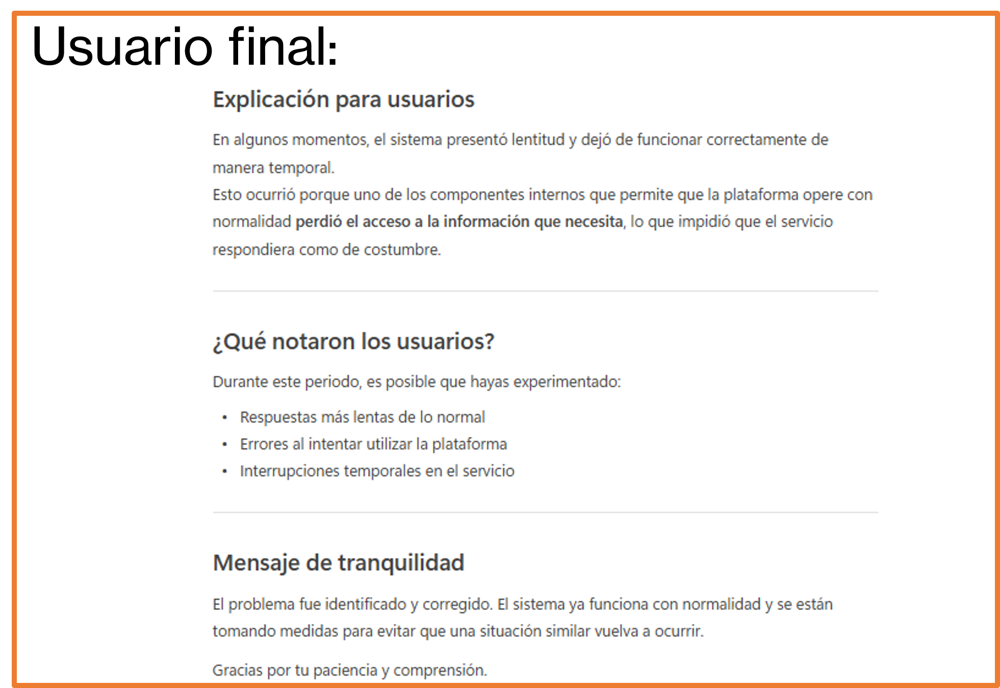

# Práctica 4. Traductor Técnico: Traduce lenguaje técnico a lenguaje simple, explica errores o conceptos TI

## Objetivo de la práctica:
Al finalizar esta actividad, serás capaz de utilizar Microsoft 365 Copilot Chat para traducir lenguaje técnico a lenguaje simple, explicar errores técnicos y conceptos de TI a audiencias no técnicas y ajustar el nivel de profundidad de la explicación según el público.

## Duración aproximada:
- 7 minutos.

## Tabla de ayuda:
Para que puedas replicar esta práctica, se recomienda iniciar sesión con tu correo corporativo en la siguiente plataforma:

| Sitio web | Enlace |
| --- | --- | 
| m365 Copilot | https://m365.cloud.microsoft/ |

## Instrucciones 
Usted trabaja en un equipo de TI y necesita explicar a un usuario de negocio o a un gerente un problema técnico ocurrido durante el despliegue de una aplicación.
El mensaje original es muy técnico y genera confusión, por lo que usará Copilot Chat para convertirlo en una explicación clara y comprensible.

### Tarea 1. Acceso a Microsoft 365 Copilot Chat
Paso 1. Acceder a m365 Copilot desde https://m365.cloud.microsoft/

Paso 2. Iniciar sesión con cuenta profesional o educativa.

Paso 3. Dar clic en "Nuevo chat" para crear una nueva conversación y asegurarse de encontrarse en "modo web"


### Tarea 2. Solicitud inicial
Paso 1. Escribir en el recuadro de chat la siguiente solicitud (prompt) y enviarla (dar clic en la flecha de la esquina inferior derecha o presionar Enter).

```text
Explica este error:

El incidente se debió a un fallo en la sincronización del servicio backend con la base de datos principal,
causado por un error de autenticación en el API debido a credenciales expiradas.
Esto provocó latencia elevada y respuestas HTTP 500 intermitentes en el frontend.
```

Paso 2. Observar el resultado

- ¿El lenguaje sigue siendo técnico?
- ¿Sería entendible para alguien sin conocimientos de TI?
- ¿Aclara el impacto real del problema?

### Tarea 3. Solicitud con mayor información
Paso 1. En la misma conversación, redactar el siguiente prompt:

```text
Necesito explicar un incidente técnico a una audiencia no técnica.
El mensaje está dirigido a un gerente de área sin conocimientos de TI.
Debes explicar qué ocurrió de forma clara y fácil de entender.
Traduce el texto técnico a un lenguaje simple, sin usar términos técnicos complejos,
e incluye brevemente cuál fue el impacto del problema.

Texto original:
El incidente se debió a un fallo en la sincronización del servicio backend con la base de datos principal, causado por un error de autenticación en el API debido a credenciales expiradas.
Esto provocó latencia elevada y respuestas HTTP 500 intermitentes en el frontend.
```

Observar cómo:
- Se eliminan términos complejos
- El mensaje se vuelve claro y entendible
- El enfoque es comunicacional, no técnico

Paso 2. Realizar una iteración adicional en la misma conversación utilizando el siguiente prompt:

```text
Reescribe la explicación como si se la fueras a comunicar a un usuario final,
usando un tono tranquilo y evitando cualquier lenguaje técnico.
```

Observar cómo cambia:
- El tono
- El nivel de detalle
- La cercanía en el lenguaje

Paso 3. Enviar un prompt que modifique la audiencia, por ejemplo:

```text
Ahora explica el mismo incidente para un director ejecutivo,
enfocándote en el impacto, la causa general y las acciones correctivas.
```

Observar cómo cambia:
- Enfoque en impacto y decisiones
- Menos detalle técnico
- Lenguaje orientado a negocio

Paso 4. Reflexionar:

- ¿Cuál usaría en cada contexto?
- ¿Qué cambió en el mensaje al cambiar el prompt?
- ¿Cómo ayuda Copilot a mejorar la comunicación entre áreas?

### Resultado esperado
Al finalizar esta práctica, el participante será capaz de comprender que:
- Copilot Chat puede actuar como traductor entre el mundo técnico y el negocio.
- La calidad de la explicación depende directamente del prompt y del público definido.
- Un mismo contenido técnico puede adaptarse a múltiples audiencias.
- El uso de IA mejora la comunicación, reduce malentendidos y ahorra tiempo.

Se obtendrá un resultado parecido a:





