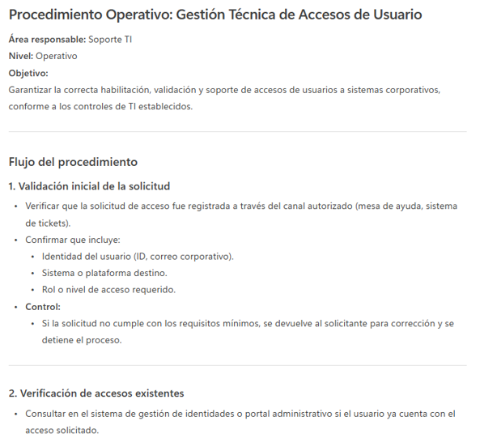

# Práctica 5. Documentación y Procedimientos: Convierte texto informal en procedimientos, organiza pasos, mejora documentación técnica

## Objetivo de la práctica:
Al finalizar esta actividad, serás capaz de utilizar Microsoft 365 Copilot Chat para convertir texto informal en procedimientos estructurados, organizar información dispersa en pasos claros y ordenados y mejorar la claridad, consistencia y profesionalismo de la documentación técnica.

## Duración aproximada:
- 8 minutos.

## Tabla de ayuda:
Para que puedas replicar esta práctica, se recomienda iniciar sesión con tu correo corporativo en la siguiente plataforma:

| Sitio web | Enlace |
| --- | --- | 
| m365 Copilot | https://m365.cloud.microsoft/ |

## Instrucciones 
Usted forma parte de un equipo de TI o de operaciones y necesita documentar un proceso que normalmente se explica de manera informal entre compañeros.
El objetivo es crear un procedimiento claro y estandarizado que pueda ser utilizado por cualquier miembro del equipo.

### Tarea 1. Acceso a Microsoft 365 Copilot Chat
Paso 1. Acceder a m365 Copilot desde https://m365.cloud.microsoft/

Paso 2. Iniciar sesión con cuenta profesional o educativa.

Paso 3. Dar clic en "Nuevo chat" para crear una nueva conversación y asegurarse de encontrarse en "modo web"


### Tarea 2. Prompt inicial
Paso 1. Escribir en el recuadro de chat la siguiente solicitud (prompt) y enviarla (dar clic en la flecha de la esquina inferior derecha o presionar Enter).

```text
Convierte este texto en un procedimiento.

Primero hay que checar si el usuario ya tiene acceso.
Si no, se le asigna el permiso desde el portal.
Luego se prueba que sí pueda entrar.
Si algo falla, se revisa con TI.
```

Paso 2. Observar el resultado:

- ¿Está bien estructurado?
- ¿Los pasos son claros?
- ¿Podría usarlo alguien sin contexto previo?

### Tarea 3. Solicitud con mayor información
Paso 1. En la misma conversación, redactar el siguiente prompt:

```text
Necesito documentar un procedimiento interno.
El procedimiento será utilizado por el equipo de soporte para gestionar accesos de usuarios.
Convierte el texto informal en un procedimiento claro y estandarizado.
Organiza la información en pasos numerados, usando un lenguaje claro y profesional.

Texto original:
Primero hay que checar si el usuario ya tiene acceso.
Si no, se le asigna el permiso desde el portal.
Luego se prueba que sí pueda entrar.
Si algo falla, se revisa con TI.
```

Observar cómo:

- Se ordenan claramente los pasos
- El lenguaje es más formal
- El procedimiento es reutilizable

Paso 2. Refinar el procedimiento con una iteración:

```text
Mejora el procedimiento agregando validaciones básicas y considerando qué hacer si un paso falla.
```

Observa:

- Cómo se incluyen decisiones
- Hay mayor robustez del procedimiento
- Enfoque preventivo

Paso 3. Solicitar una versión más técnica:

```text
Reescribe el procedimiento con un enfoque técnico,
asumiendo que será parte de una guía operativa de TI.
```

Observar:

- Uso de lenguaje más técnico
- Enfoque en precisión
- Estilo de documentación técnica formal

Paso 4. Reflexionar:

- ¿Cuál usaría para usuarios nuevos?
- ¿Cuál para el equipo de TI?
- ¿Qué tan claro quedó el proceso final?

### Resultado esperado
Al finalizar esta práctica, el participante será capaz de comprender que:
- Copilot Chat puede transformar información informal en documentación estructurada.
- Un buen prompt permite:
    - Estandarizar procesos
    - Reducir errores
    - Facilitar la transferencia de conocimiento
- La documentación mejora mediante iteraciones y ajustes de contexto.
- Copilot es una herramienta clave para mejorar la calidad de la documentación técnica.

Se obtendrá un resultado parecido a:


