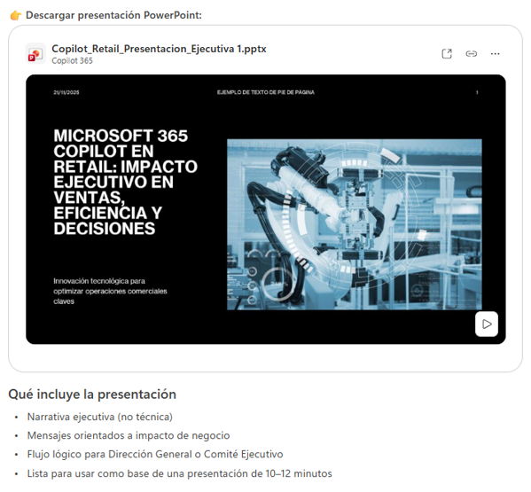

# Práctica 6. Generador de Estructuras: Crea estructuras de documentos, diseña esquemas de presentaciones, organiza ideas

## Objetivo de la práctica:
Al finalizar esta actividad serás capaz de utilizar Microsoft 365 Copilot Chat para crear estructuras de documentos, diseñar esquemas de presentaciones ejecutivas, organizar ideas dispersas sobre ventas, clientes y operaciones en contenido estructurado y coherente.

## Duración aproximada:
- 8 minutos.

## Tabla de ayuda:
Para que puedas replicar esta práctica, se recomienda iniciar sesión con tu correo corporativo en la siguiente plataforma:

| Sitio web | Enlace |
| --- | --- | 
| m365 Copilot | https://m365.cloud.microsoft/ |

## Instrucciones 
Usted trabaja en una cadena retail y debe preparar material para presentar una iniciativa de uso de Microsoft 365 Copilot orientada a mejorar:

- La operación de tiendas
- El análisis de ventas
- La experiencia del cliente

Solo cuenta con algunas ideas generales del negocio. Usará Copilot Chat para convertirlas en una estructura clara de documento y presentación.

### Tarea 1. Acceso a Microsoft 365 Copilot Chat
Paso 1. Acceder a m365 Copilot desde https://m365.cloud.microsoft/

Paso 2. Iniciar sesión con cuenta profesional o educativa.

Paso 3. Dar clic en "Nuevo chat" para crear una nueva conversación y asegurarse de encontrarse en "modo web"


### Tarea 2. Solicitud incluyendo toda la información necesaria
Paso 1. Escribir en el recuadro de chat la siguiente solicitud (prompt) y enviarla (dar clic en la flecha de la esquina inferior derecha o presionar Enter).

```text
Necesito crear la estructura de un documento.
El documento está dirigido a personal de negocio del sector retail.
Necesito explicar cómo Microsoft 365 Copilot apoya las operaciones de tiendas,
el análisis de ventas y la experiencia del cliente.
Genera una estructura clara con secciones y subtítulos,
organizada de forma lógica y con enfoque en retail.

Ideas base:
Usar Copilot en retail.
Ayuda a tiendas.
Seguridad.
Ejemplos.
Conclusión.
Mejora análisis de ventas.
Soporte a equipos.
```

Observa cómo:

- Se contextualiza en retail
- Se organiza el contenido por temas del negocio
- La estructura es profesional y reutilizable

Paso 2. Solicitar la generación de un esquema de una presentación ejecutiva:

```text
Usa la estructura anterior y crea un esquema de presentación de 6 a 8 diapositivas
para una presentación sobre el uso de Copilot en el sector retail.
Incluye el título de cada diapositiva y una breve descripción.
```

Observa:
- El flujo lógico de la presentación
- Separación clara entre operación, análisis y beneficios
- Enfoque en negocio retail

Paso 3. Ajustar el contenido a la audiencia:

```text
Adapta el esquema de la presentación para una audiencia ejecutiva del sector retail,
enfocándote en impacto en ventas, eficiencia operativa y toma de decisiones.
```

Observa:

- Simplificación del contenido
- Mayor enfoque en impacto y valor
- Lenguaje orientado a liderazgo

Paso 4. Crear una presentación de PowerPoint:

```text
Convierte esto en una presentación PowerPoint
```

Abrir la presentación y verificar si el contenido cumple con todas las características que se definieron en los prompts anteriores.

### Resultado esperado
Al finalizar esta práctica, el participante será capaz de comprender que:
- Copilot Chat puede organizar ideas del sector retail de forma rápida y clara.
- El valor del resultado depende de:
    - Definir contexto 
    - Especificar audiencia
    - Indicar tipo de contenido
- Un mismo conjunto de ideas puede convertirse en:
    - Documento operativo
    - Presentación ejecutiva
- Copilot acelera la planeación de contenido empresarial en cualquier sector.

Se obtendrá un resultado parecido a:


