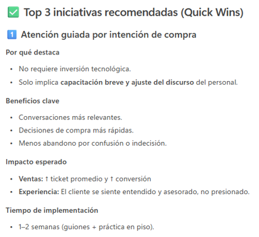
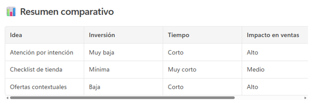
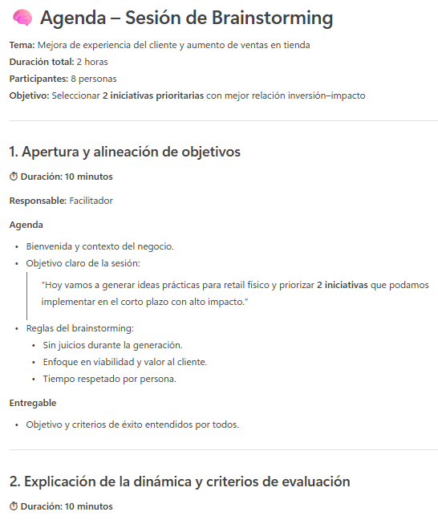

# Práctica 7. Ideas y Brainstorming: propone opciones, ayuda a analizar escenarios, apoya sesiones de ideación

## Objetivo de la práctica:
Al finalizar esta actividad, serás capaz de utilizar Microsoft 365 Copilot Chat para proponer ideas y opciones, apoyar sesiones de brainstorming estructuradas, analizar escenarios posibles, ventajas y riesgos de cada opción.

## Duración aproximada:
- 7 minutos.

## Tabla de ayuda:
Para que puedas replicar esta práctica, se recomienda iniciar sesión con tu correo corporativo en la siguiente plataforma:

| Sitio web | Enlace |
| --- | --- | 
| m365 Copilot | https://m365.cloud.microsoft/ |

## Instrucciones 
Usted rabaja en una empresa del sector retail que busca mejorar la experiencia del cliente y las ventas en tienda.
Su equipo realizará una sesión de ideación para proponer iniciativas que puedan implementarse en el corto y mediano plazo. Usará Copilot Chat como apoyo para generar y analizar ideas.

### Tarea 1. Acceso a Microsoft 365 Copilot Chat
Paso 1. Acceder a m365 Copilot desde https://m365.cloud.microsoft/

Paso 2. Iniciar sesión con cuenta profesional o educativa.

Paso 3. Dar clic en "Nuevo chat" para crear una nueva conversación y asegurarse de encontrarse en "modo web"


### Tarea 2. Descripción de la tarea a realizar.
Paso 1. Paso 1. Escribir en el recuadro de chat la siguiente solicitud (prompt) y enviarla (dar clic en la flecha de la esquina inferior derecha o presionar Enter).

```text
Necesito realizar una sesión de brainstorming.
Somos una empresa del sector retail con tiendas físicas.
Necesitamos generar ideas para mejorar la experiencia del cliente y aumentar las ventas en tienda.
Propón al menos 5 ideas prácticas y realistas, orientadas a retail,
enfocadas en atención al cliente, tecnología o procesos operativos.
```

Observa el resultado:

- ¿Las ideas están enfocadas en retail?
- ¿Son accionables?

Paso 2. Solicitar análisis profundo de cada idea:

```text
Para cada idea propuesta, analiza con mayor detalle:
- Beneficios potenciales
- Riesgos o desafíos
- Impacto esperado en ventas o experiencia del cliente
```

Paso 3. Solicitar enfoque en algún escenario de su interés, por ejemplo:

```text
De las ideas anteriores, identifica las 3 que podrían implementarse en el corto plazo
con menor inversión y mayor impacto.
```

Observa:
- ¿Copilot justifica por qué considera que las ideas implican una menor inversión y un mayor impacto?
- ¿Con qué estructura se presenta la respuesta generada?

Paso 4. Solicitar creación de agenda para una sesión de brainstorming donde se aborden las ideas anteriores:

```text
Crea una agenda estructurada para una reunión de brainstorming con 8 personas. La reunión tendrá una duración de 2 horas. Cada persona compartirá sus 3 mejores ideas y su justificación (como lo hicimos en el paso anterior), finalmente se seleccionarán de forma grupal las 2 que presenten la mejor relación inversión-impacto.
```

Observa:
- Nivel de detalle en las actividades de la agenda
- Tiempos definidos

### Resultado esperado
Al finalizar esta práctica, el participante será capaz de comprender que:
- Copilot Chat es una herramienta efectiva para generar y estructurar ideas.
- La clave del buen brainstorming con IA está en:
    - Definir contexto 
    - Establecer un objetivo claro
    - Pedir análisis y priorización
- Copilot ayuda tanto en la fase creativa como en la fase analítica.
- Las ideas se convierten más rápido en opciones accionables.

Se obtendrá un resultado parecido a:





